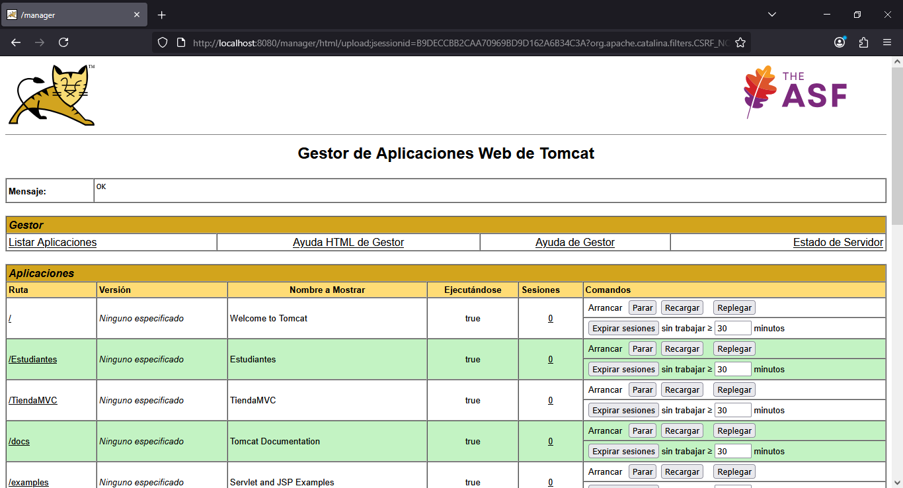
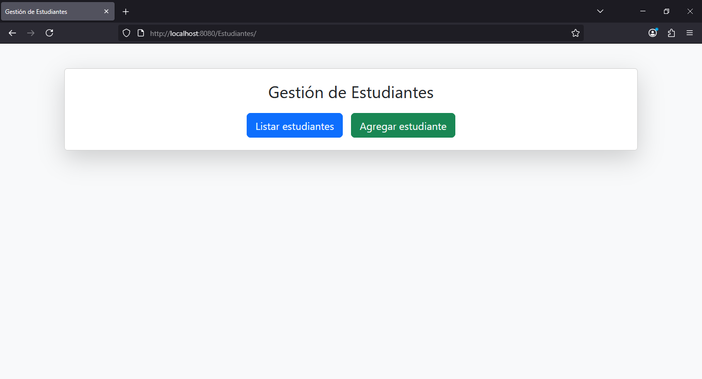
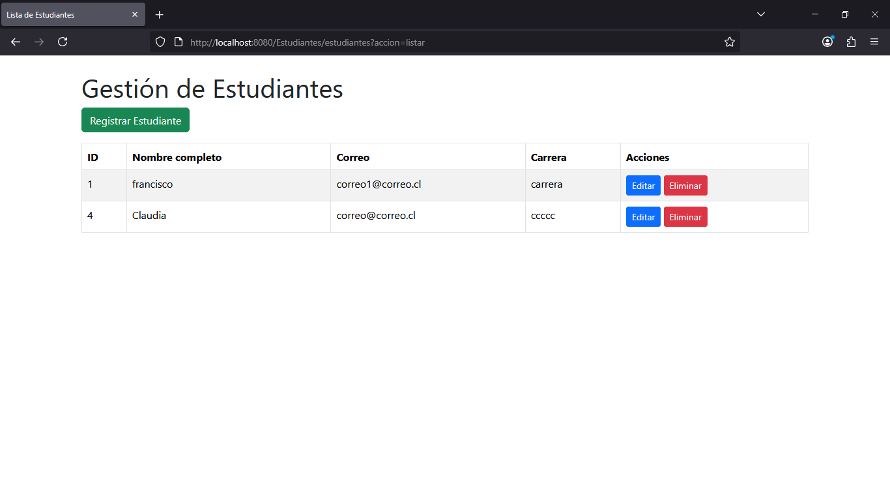
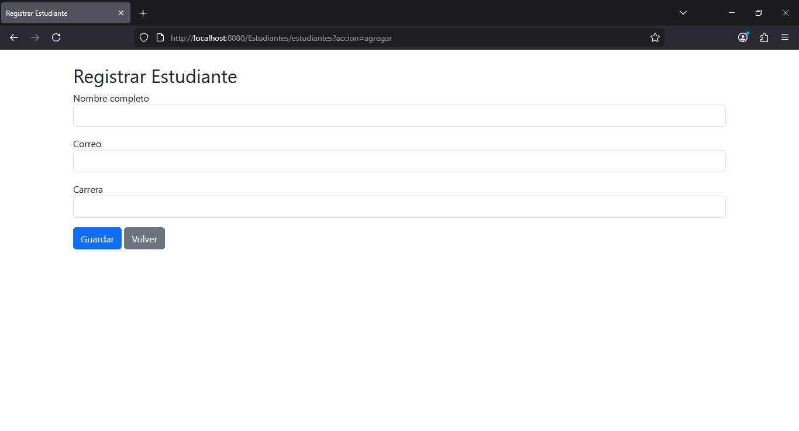

# 📘 Sistema de Gestión de Estudiantes – JSP/Servlets/MVC

Este proyecto es una aplicación web desarrollada con **Java EE (JSP + Servlets)** utilizando el patrón **MVC**. 
Permite administrar estudiantes dentro de una institución educativa, ofreciendo funcionalidades CRUD completas:

- Registrar un estudiante
- Listar estudiantes
- Editar estudiante
- Eliminar estudiante

El sistema conecta con una base de datos MySQL y está diseñado para ejecutarse en **Apache Tomcat**.

## 🏗️ Tecnologías utilizadas

- Java 21 
- JSP para la capa de vista
- Servlets para controladores
- Patrón MVC
- MySQL como base de datos
- JDBC para conexión
- Bootstrap 5 para diseño
- Apache Tomcat 11

## 📁 Estructura del proyecto

/src/java/com/skillnest
 ├── controller/
 │     └── EstudianteServlet.java
 ├── model/
 │     ├── EstudianteDAO.java
 │     └── Estudiante.java
 └── util/
       └── ConexionBD.java

/webapp
 ├── META-INF/
 ├── WEB-INF/
 │     ├── lib
 │     └── web.xml
 ├── index.jsp
 ├── listar.jsp
 ├── agregar.jsp
 └── editar.jsp
 
/img
 └── capturas del sistema

/dist
 └── Estudiantes.war
 
 /sql
 └── estudiantes.sql

## 🗄️ Base de datos (MySQL)

Se incluye en carpeta sql  un archivo `estudiantes.sql` con la siguiente estructura:

CREATE DATABASE Colegio;
USE Colegio;

CREATE TABLE estudiantes (
    id INT AUTO_INCREMENT PRIMARY KEY,
    nombre VARCHAR(100) NOT NULL,
    email VARCHAR(100) NOT NULL,
    carrera VARCHAR(100) NOT NULL
);

## 🚀 Despliegue del proyecto

### Requisitos previos

- Java JDK instalado
- Apache Tomcat instalado
- MySQL funcionando
- IDE: Eclipse STS

### Configuración de la conexión a MySQL

Editar `src/model/ConexionBD.java`:

private final String URL = "jdbc:mysql://localhost:3306/Colegio";
private final String USER = "root";
private final String PASS = "tu_contraseña";

### Ejecución desde IDE

1. Importar proyecto como Web Application.
2. Limpiar y compilar.
3. Ejecutar en Tomcat.

URL:

http://localhost:8080/Estudiantes

### Despliegue mediante archivo WAR

1. Cargar mediante Manager de tomcat http://localhost:8080 el archivo Estudiantes.war
2. Desplegar aplicacion
3. http://localhost:8080/Estudiantes

## 🖼️ Capturas de pantalla

Agrega imágenes en `/img`:

## 📄 Funcionalidades

✔ CRUD completo  
✔ Validaciones básicas  
✔ Bootstrap  
✔ Rutas con request.getContextPath()  
✔ Mensajes de éxito/error  

## 📚 MVC

- Modelo: Estudiante
- Vista: JSP
- Controlador: EstudianteServlet
- DAO: clases JDBC

## 📜 Licencia

Proyecto de uso educativo.
